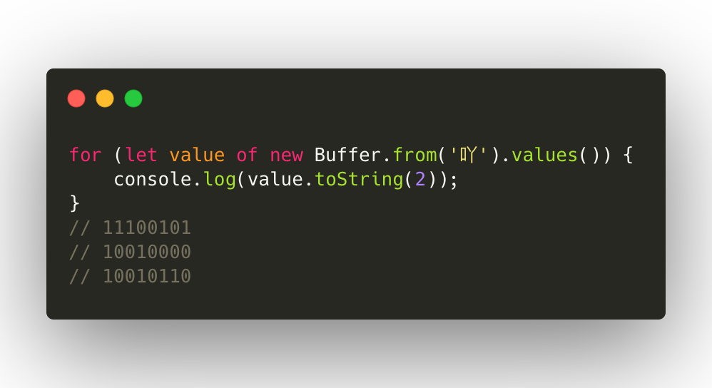
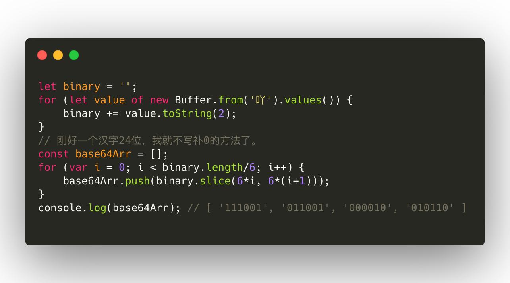
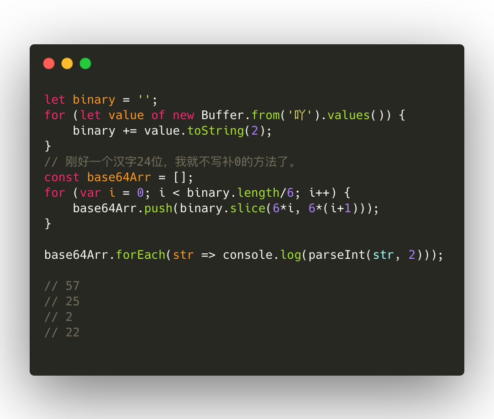
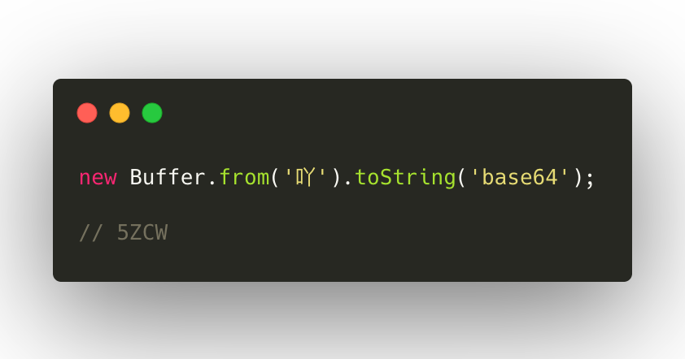

# base64是加密还是编码？我用JS来讲给你听。
### 是编码。
base64根本不是什么加密，就是一种编码方式，你问为什么，且听我细细道来。

---

## 二进制
~~我们都知道~~大家应该知道，机器语言一般都是二进制的，在一个字节`(byte)`上，是八个位`(bit)`，每位上可以存放0或者1，通常一个字节可以存入一个ASCII码，两个字节存放一个国标汉字，现在大多数是UTF-8的编码，用的是三个字节。所以下面咱们以汉字为例，来说明base64为什么只是一种编码而不是一种加密方式。

## 吖
以《现代汉语词典》第5版第一页第一个字“吖”为例，UTF-8编码下转为二进制，咱们先写一段简单的代码：

简单来说就是“吖”占用了三个字节，每个字节分别是229，144，150，转换为二进制编码就是“11100101 10010000 10010110”，共计二十四个位。

当使用base64编码之后，会以每三个字节为一组，把“11100101 10010000 10010110”转换成“111001 011001 000010 010110”，然后三字节就变成了四字节。用代码来写一下就是：

简单点来说就是三八二十四换成了四六二十四。那每个字节前面剩下的两个位，怎么办呢？嗯…我有10块，和我有00000010块，代表的意思一样，所以可以简单理解为在计算机中，没有就是0。

但凭空多了一个字节，有什么好处呢？因为base64编码每个字节只写了六个位，所以一共对应的只有2^6=64个可打印的字符（其实base`64`的64是这个意思啦），在Base64中的可打印字符包括字母`A-Z`、`a-z`、数字`0-9`，这样共有62个字符，此外两个可打印符号在不同的系统中而不同。在JavaScript中，这两个字符是`+`和`/`。

所以先把“111001 011001 000010 010110”转换为十进制，咱们来简单的修改一下代码：

按照编码表(`第一位是0位，为A`)就能知道“吖”转为base64之后是“5ZCW”。

那么我上面算的这些对不对呢？咱们来验证下，JavaScript提供了简单的方法：

所以反过来一样可以知道“5ZCW”是“吖”，这也是base64只是一种编码而不是一种加密方式的原因。

> 注意：在浏览器中可以直接使用btoa来直接把普通字符串转换成base64字符串，但无法转换汉字，这时候需要先额外把汉字转换成其他编码`比如URI`，但这样和直接转为base64的结果是不同的。

